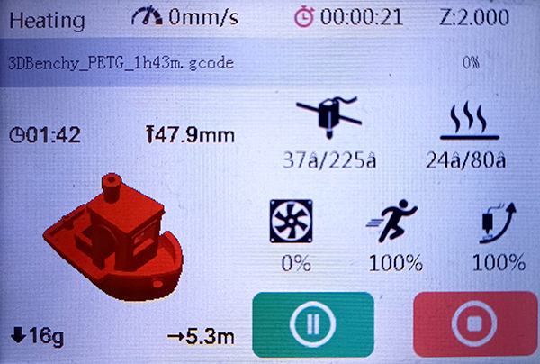

# Yet another PrusaSlicer/OrcaSlicer thumbnail script for old printers

This fork expands support for old printers that expect thumbnails in raw RGB565 format using the classic `simage` / `gimage` + `M10086` workflow.

Originally made for my **Flying Bear Ghost 5**, but I think works on any printer with MKS Robin Nano (V1.x – V3.x), old Elegoo Neptune series, some Anycubic models, etc.

Image example:

### Example command used for the screenshot above
"C:\OrcaScripts\thumbnail.exe" "--old_printer"  "--images" "50x50/simage,200x200/gimage" "--mks_fix" "--original_image_light_theme" "--short_duration_format" 

### Differences from the original project
- Arbitrary thumbnail sizes for old printers (not limited to 100×100 / 200×200)
- Light theme compatibility for old-printer thumbnails
- Transparent black (0x0000) is replaced with dark gray (0x0821) – letters no longer have holes
- Improved RGB565 color handling (I hope so)
- Fixed color shift on certain MKS Robin Nano firmwares
- No “duration / filament” text overlay on very small images (≤ 50 px width)

Huge thanks to everyone who worked on the original project.

## Installation

- Download the [latest release](https://github.com/saileraleks/ElegooNeptuneThumbnailPrusaMod);
- Unzip the executable and put it to desired location.

## How to configure PrusaSlicer:

1. `Printer Settings` / `General` / `G-code thumbnails` -- put something like `300x300`;
2. `Printer Settings` / `General` / `Format of G-code thumbnails` select `PNG` or `JPG`:
3. `Print Settings` / `Output options` / `Post-processing scripts` - specify path to executable: `"C:\Path\Where\You\Put\thumbnail.exe";`:

## How to configure OrcaSlicer:

- `Printer Settings` / `Basic information` / `G-code thumbnails` -- put something like `300x300`;
- `Printer Settings` / `Basic information` / `Format of G-code thumbnails` select `PNG` or `JPG`;
- `Print Settings` / `Others` / `Post-processing Scripts` - specify path to executable: `"C:\Path\Where\You\Put\thumbnail.exe";`:

PrusaSlicer/OrcaSlicer should now run the thumbnail.exe when you export your g-code.
In case of issues - check `thumbnail.log`.

If you do not specify any options, the first thumbnail from g-code file that is bigger than 100x100 will be used: decoded, resized, encoded into new format and injected back into g-code file.

If PrusaSlicer/OrcaSlicer is configured to add more than one thumbnail into g-code file, you can specify what thumbnail the script should use with option:
`--image_size WIDTHxHEIGHT`

## Running from the Python script

If you do not want to run the supplied executable (as myself), you can always run the Python script directly:
- Install Python (remember directory where you installed it);
- Clone the repo (or download `thumbnail.py` + `lib_col_pic.py` and put them into the same folder);
- In `Post-processing scripts` put `"C:\Path\Where\You\Installed\python.exe" "C:\Path\Where\You\Put\thumbnail.py";`
- Or, to hide the terminal window: `"C:\Path\Where\You\Installed\pythonw.exe" "C:\Path\Where\You\Put\thumbnail.py";`

## Building your own executable from the Python script

- Install Python (remember directory where you installed it);
- Install pyinstaller: `pip install pyinstaller`;
- Clone the repo;
- Open console, navigate to the repo folder and run `pyinstaller build.spec` or just run supplied `build.bat` => `thumbnail.exe` will be created in `dist` folder.

## Compatibility

Tested with OrcaSlicer 2.3.1 on Flying Bear Ghost 5.

## Supported command line parameters

- `--info info-abbr-top-left,info-abbr-top-right,info-abbr-bottom-left,info-abbr-bottom-right`
  What information to add to image in each corner. Supported info-abbr values: `print_duration`, `model_height`, `filament_weight`, `filament_length`, `filament_cost`
  Default: `print_duration, model_height, filament_weight, filament_length`
- `--short_duration_format`
  Use short format for `print_duration` (`1d 23:45` instead of `1d 23h 45m 56s`. Who need these seconds, really?)
- `--currency $`
  Currency character for `filament_cost`
  Default: `$`
- `--currency_suffix`
  Currency character is added as a suffix (example: `10$`). Without the option (default), it is added as a prefix (example: `$10`)
- `--update_original_image`
  Original image (that is used by Klipper) is also modified with text info. So you will see the modified image in fluidd.
- `--original_image_light_theme`
  Original image will be adjusted for light Klipper's theme. Use this option if you use light fluidd theme (without the option it is adjusted for dark fluidd theme -- default Klipper theme), also works with `--old_printer`
- `--debug`
  Write debug information into `thumbnail.log` and save resized images in program folder. I will ask you to run with the option and supply log in case you face any issues.
- `--old_printer`
  Generate thumbnails for Neptune 2 series printers & older
- `--image_size 200x200`
  Without this option the first thumbnail that is bigger than 100x100px from g-code file will be used.
  If specified, the script will try to find in g-code thumbnail with the specified size. It will report error if such thumbnail is not found. So I'd recommend not to use the option at all and only specify size 300x300 in 'Printer Settings'.
- `--images WxH/gimage,WxH/simage`
  Images to be generated in specified order.
  Default: `200x200/gimage,160x160/simage`
- `--no-modify_slicer_header`
  Original slicer header will not be modified. This option should only be used if your printer firmware displays thumbnail without Cura mentioned in gcode.
-  `--mks_fix`
  This option allows to avoid color distortion of thumbnails on some MKS firmwares.

To add script's command line option in PrusaSlicer/OrcaSlicer, make sure you wrap them in double quotes:
`"C:\ElegooNeptuneThumbnailPrusaMod\thumbnail.exe" "--image_size" "300x300";`

## Contribution

This repository is based on:
- [fifonik/ElegooNeptuneThumbnailPrusaMod](https://github.com/fifonik/ElegooNeptuneThumbnailPrusaMod)
- [TheJMaster28/ElegooNeptuneThumbnailPrusa](https://github.com/TheJMaster28/ElegooNeptuneThumbnailPrusa)
- [Molodos/ElegooNeptuneThumbnails-Prusa](https://github.com/Molodos/ElegooNeptuneThumbnails-Prusa)
- [sigathi/ElegooN3Thumbnail](https://github.com/sigathi/ElegooN3Thumbnail)

Therefore it is released under the **AGPL v3** license.
